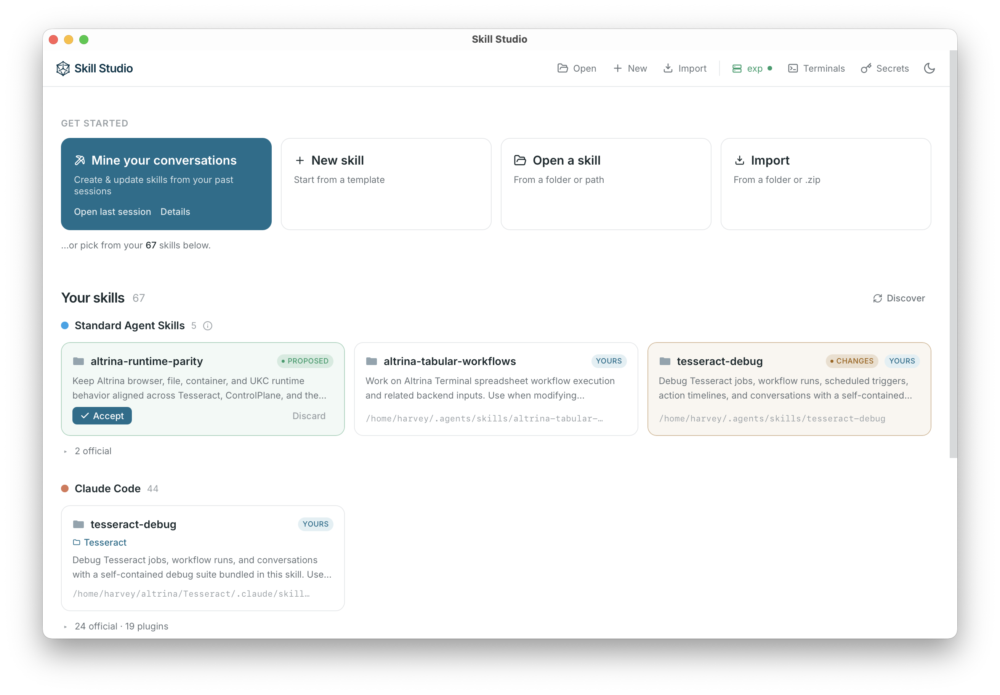

# Skill Studio

A desktop app for **viewing, editing, versioning, and running
[Agent Skills](https://agentskills.io/home)** — the portable folders of human
expert knowledge that agents load on demand.



Managing skills is like managing a team's culture and policies: written once,
leveraged by every agent. Studio gives that knowledge a human interface so you
can see, diff, version, and share your skills instead of letting them drift
across a dozen agent config dirs.

Built with [Tauri](https://tauri.app/) (Rust backend + React/TS frontend). The
backend is separable from the UI, so it runs natively *or* headless on a remote
box you drive from a browser (the VS Code-remote model — see [`design.md`](./design.md)).

## Features

- **Discover** every skill on your machine — across Claude Code, Codex, Cursor,
  Gemini CLI, OpenClaw, the shared `~/.agents/skills` standard, and project repos
  — classified personal / official / plugin.
- **Skill Mining** — use a local agent to analyze your past agent
  conversations and create / update skills.
- **Rendered Markdown editing** — `SKILL.md` and other Markdown files rendered
  as a clean, Notion-like document with frontmatter badges, a GFM body, and a
  full file-tree browser.
- **Automatic versioning** — a VS Code-style Source Control panel per skill:
  working-tree changes, inline diffs, discard, and numbered commit history,
  parent-repo aware. Commit messages are drafted locally by the on-device 2B
  Qwen model — nothing leaves the machine.
- **Secrets manager** — one machine-local store. Terminals launched from the
  app inject the secrets into the agent's environment automatically. Secrets in
  use are auto-detected and can be bundled on skill export, for
  "batteries-included" skill sharing within a team.
- **Terminals & remote hosts** — run Claude Code, Codex, or a shell in
  tmux-backed sessions that survive UI disconnect, so you can close your laptop
  and pick the run back up later. Point Studio at an SSH host or a local WSL
  distro to edit and run skills on that machine as if it were local (the VS
  Code-remote model).

## Run it

```bash
npm install
npm run dev          # native desktop
```

| Mode | Command | Open |
|------|---------|------|
| Native desktop | `npm run dev` | the app window |
| Browser, local backend | `cargo run -p skill-server` + `npm run dev:vite` | `localhost:1420` |
| Production | `npm run build`, then run `skill-server` | skill-server's port |

Open a skill via the discovered list, the top-bar path input, **Browse…**, or a
`?path=/abs/path/to/skill` deep link. The on-device LLM bundles a prebuilt
`llama-server` (`scripts/fetch-engine.sh`); the model downloads on first use.
`examples/` holds real document skills (`docx`, `pdf`, `pptx`, `xlsx`).

## Roadmap

The thesis: the future is humans and AI agents **collaborating**, not humans
replaced — and skills are the medium for human expert knowledge, so they need a
first-class human UX. Next:

1. **Version-controlled team collaboration & team secret managers** — share
   skills and the secrets they need across a team, account-backed.
2. **Multi-modal skills / SOP documents** in a readable format.
